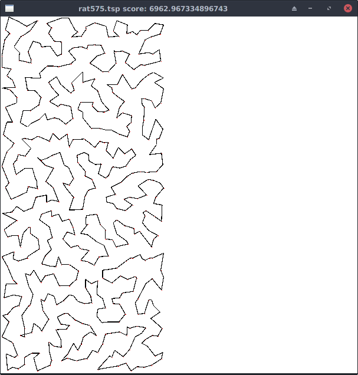

# 概要
二次元ユークリッド平面上における巡回セールスマン問題における焼きなまし法の実装で、近傍関数は2-optを使用し数種類の冷却スケジュールを実装してあります。
あくまで実験用のソースコードで、他人が使用することを前提に書かれていないので、可読性等にはかなり問題があると思われます。他に、コンパイルに(初回のみ)4分程度かかる点、デバッグモードを指定しない場合4スレッド立ちあげる点に注意してください。



# 使いかた
10回やって平均をとる
```
cargo run --release -- --time 10 --cooler c1 --iter 10
```

ビジュアライザを起動する
```
cargo run -- --time 10 --cooler c1 --iter 1 --vis
```
releaseビルドだと複数ウインドウが開けないバグがあります。

ログファイルに出力する
```
cargo run --release -- --time 3 --cooler c1 --iter 1 --debug log.txt
```
1つのデータのみを1スレッドで実行します。ログファイルには上書きせず追記します。

ヘルプを見る
```
your_shell@sa_test) cargo run --release -- --help
    Finished release [optimized] target(s) in 0.0 secs
     Running `target/release/sa_test --help`
sa_test 1.0
kngwyu
Test of simulated annealing

USAGE:
    sa_test [FLAGS] [OPTIONS]

FLAGS:
    -V, --vis        Use Visualize(defualt=>false)
    -h, --help       Prints help information
        --version    Prints version information

OPTIONS:
    -C, --cooler <COOLER>    Sets cooler type(c1..c5 default=>climb)
    -D, --debug <FNAME>      Use debug mode(only 1 thread runs and create Log
                             file<FNAME>)
    -I, --iter <ITER>        Sets iteration number(default=>1)
    -T, --time <TIME>        Sets execution time(default=>5)

```

# 著作権表示
[piston](https://github.com/PistonDevelopers/piston)、[slog](https://github.com/slog-rs/slog)、[clap](https://github.com/kbknapp/clap-rs)などのライブラリを使用しています。
また、データは[TSPLIB](http://elib.zib.de/pub/mp-testdata/tsp/tsplib/tsplib.htm)のものを使用しました。
このソフトウェア自体はUnlicenseのもとで公開します。
